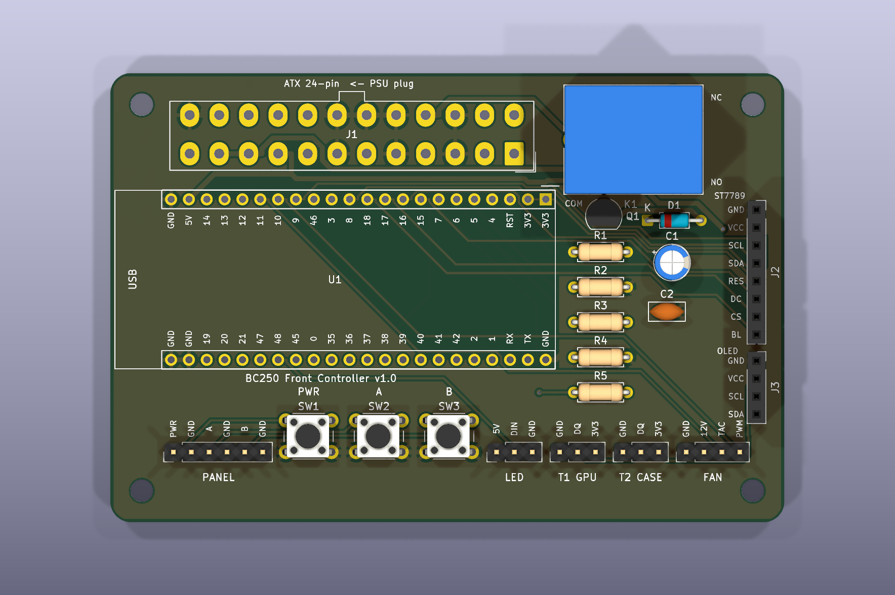
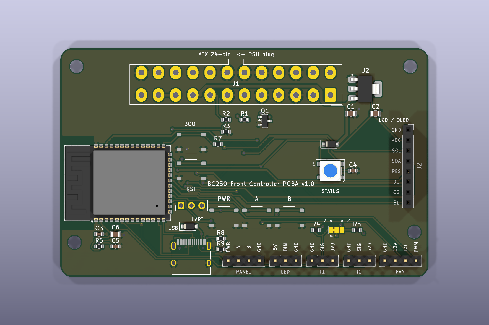
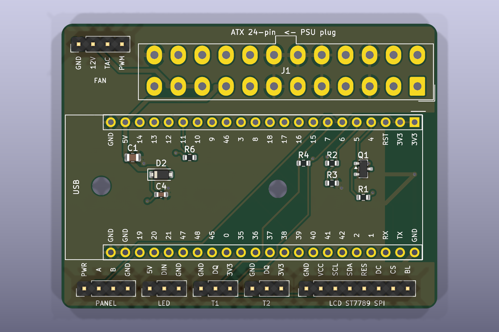

# BC250 Front Controller

**AMD BC-250을 진짜 PC처럼** — 전원 버튼, 정상 종료, 온도 기반 팬 커브, OLED 상태 화면, Home Assistant 연동까지. ESP32-S3 하나로 전부 독립 동작합니다.

[🇺🇸 English README](README.md)

> ⚠️ **상태: 개발 진행 중.** 펌웨어는 보드에서 부팅 검증 완료, 실제 BC-250에 물린 전체 하드웨어 검증은 진행 중입니다.

## 왜 만들었나

AMD BC-250은 20만 원 안팎에 PS5 APU를 쓸 수 있는 물건이지만, 마이닝 랙에서 태어난 탓에 데스크탑으로 쓰기엔 없는 게 너무 많습니다:

- ❌ 전원 버튼 없음, ACPI 없음 — 파워 켜짐 = 보드 켜짐
- ❌ 정상 종료 불가 — 전원을 끊는 것만이 유일한 "끄기"
- ❌ 랙 섀시 밖에서는 쓸 만한 팬 제어 없음
- ❌ 상태 표시 전무

이 프로젝트는 ATX 파워와 보드 사이에 ESP32-S3를 넣어서, BC-250에 원래 없던 "전면 패널"을 만들어줍니다.

## 기능

- 🔌 **진짜 전원 버튼** — 짧게: 켜기/정상 종료, 5초 홀드: 강제 종료
- 🛡️ **Fail-safe 릴레이 설계** — `PS_ON`을 릴레이 **NC 접점**으로 유지하므로 ESP32가 죽거나 재부팅·업데이트돼도 **서버는 계속 켜져 있음**
- 🧠 **완전 독립 동작** — 정상 종료 시퀀스(OS에 HTTP 종료 요청 → 대기 → 전원 컷), 팬 커브, OLED, 버튼 전부 ESP32 안에서 동작. HA·클라우드·WiFi 없이도 됨
- 🌡️ **온도 기반 팬 커브** — DS18B20 2개(GPU 방열판·케이스), 25kHz PWM, 타코 피드백 + 팬 고장 감지
- 🖥️ **OLED 상태 화면** — 전원 상태·온도·팬 RPM·네트워크 정보
- 🎛️ **본체 설정 메뉴** — 작은 버튼 2개 + OLED로 팬 모드/프리셋, 수동 속도, 화면 밝기, 과열 임계값, 종료 대기시간을 기기에서 직접 조정 (플래시에 저장, 폰·PC 불필요)
- 🚨 **WS2812 상태 LED** — 꺼짐 / 초록(정상) / 노랑(종료 중) / 빨강(팬 고장·과열)
- 🌐 **내장 웹 대시보드** — ESP32가 직접 띄우는 관리 페이지
- 🏠 **Home Assistant 자동 등록** — ESPHome 통합으로 네이티브 연동
- 📶 **WiFi 무설정 프로비저닝** — 첫 부팅 시 `bc250-front-setup` AP + 캡티브 포털. 펌웨어에 비밀번호를 넣지 않음
- 🔄 **OTA 업데이트** — USB는 처음 한 번만
- 📴 **네트워크 단절 대응** — WiFi/HA가 끊겨도 절대 재부팅하지 않고 로컬 제어 유지, 설정 AP 자동 재오픈

## 동작 원리

BC-250은 PCIe 8핀만 쓰기 때문에 ATX 24핀 커넥터가 통째로 놀고 있습니다. 거기서 세 가닥만 빌려옵니다:

| ATX 선 | 용도 |
|---|---|
| 🟣 보라 (9번, `5VSB`) | 상시 5V — 파워가 꺼져 있어도 ESP32+릴레이에 전원 공급 |
| 🟢 녹색 (16번, `PS_ON`) | 접지되면 파워 켜짐 — 릴레이 **NC** 접점으로 유지 |
| ⚪ 회색 (8번, `PWR_OK`) | 파워가 실제로 켜졌는지 감지 (10k+10k 분압) |


정상 종료는 **ESP32가 주체**입니다 (홈오토메이션 의존 없음):

```
버튼 / 웹 / HA  →  ESP32  →  OS에 HTTP 종료 요청
                          →  60초 대기 (OS 종료 시간)
                          →  PS_ON 해제 (전원 차단)
```

## 구성 단계 — 릴레이 빼고 전부 선택사항

부품이 없다고 안 도는 게 아닙니다. OLED·센서·팬·버튼이 없으면 **그 기능 하나만 꺼질 뿐** 나머지는 정상 동작해요. 최소로 시작해서 내킬 때 하나씩 붙이면 됩니다.

| 단계 | 하드웨어 | 되는 것 | 펌웨어 |
|---|---|---|---|
| **최소** | ESP32 + 릴레이 + 점퍼선 3가닥 | 웹/HA 전원 ON·OFF, 정상 종료, 상태 LED(내장) | [`bc250-front-minimal.yaml`](bc250-front-minimal.yaml) |
| **+버튼** | + 택트 스위치 | 실물 전원 버튼 | 동일 |
| **풀옵션** | + OLED, DS18B20×2, PWM 팬, 메뉴 버튼 2개, PWR_OK 분압 | 팬 커브, 온도, 화면, 본체 설정 메뉴, PSU 상태 감지 | [`bc250-front.yaml`](bc250-front.yaml) |
| **풀옵션 + 컬러 LCD** | 위 풀옵션에서 OLED → **ST7789V 2.4인치 240×320 SPI** | 위 기능 전부 + 컬러 대형 화면·상태 아이콘·백라이트 밝기 조절 | [`bc250-front-st7789.yaml`](bc250-front-st7789.yaml) |

## PCB — 세 가지 (선택)

| | [**DIY 캐리어 보드**](hardware/bc250-front-carrier/README.ko.md) | [**반조립 PCBA**](hardware/bc250-front-pcba/README.ko.md) | [**DevKit 미니**](hardware/bc250-front-mini/README.ko.md) |
|---|---|---|---|
| 방식 | 빈 기판을 받아 직접 납땜, ESP32-S3 DevKitC-1을 꽂음 | JLCPCB Economic 조립 — ESP32-S3 WROOM 모듈·디스플레이 소켓·(선택) LED 3개만 직접 납땜 | **66×50 mm** 최소 크기 — DevKit을 꽂고, 부품은 DevKit 밑, LCD는 핀헤더에 선으로 |
| 전원 스위치 | 릴레이 | MOSFET (무소음) | MOSFET (무소음) |
| 센서 | DS18B20 | DS18B20 **또는** 10 kΩ NTC | DS18B20 |
| 비용 (5장) | 기판 ≈ $2 + 장당 부품 ≈ $8 | JLCPCB ≈ $45 + 장당 모듈 ≈ $4 → 장당 ≈ $13 | 기판 ≈ $2 (+ SMD 조립 시 ≈ $12) + DevKit |
| 펌웨어 | `relay_inverted: "false"` | 기본값 그대로 + `log_uart: USB_SERIAL_JTAG` | 기본값 그대로 (`relay_inverted: "true"`) |

셋 다 PSU의 ATX 24핀 플러그가 보드에 그대로 꽂히고, 핀맵은 위 배선과 동일합니다.





## 배선


납땜 불필요 — 수(male) 점퍼핀이 노는 ATX 24핀 구멍에 그대로 꽂힙니다.
상세 배선 설명서: [`docs/wiring-guide.html`](docs/wiring-guide.html) (OLED) · [`docs/wiring-guide-st7789.html`](docs/wiring-guide-st7789.html) (ST7789V)

## 굽기

```bash
pip install esphome
esphome run bc250-front.yaml   # 처음만 USB, 이후 OTA
```

첫 부팅 후 폰으로 **`bc250-front-setup`** WiFi에 접속 → 자동으로 열리는 설정 페이지에서 집 WiFi 선택·비밀번호 입력 → 끝. 몇 분 안에 Home Assistant가 자동 발견합니다.

> **보드 참고:** CH343 USB-시리얼 칩을 쓰는 devkit은 로거를 `hardware_uart: UART0`로 설정해야 로그가 보입니다 (yaml에 반영돼 있음).

## 로드맵

- [ ] OS 쪽 종료 에이전트(systemd 유닛) + 설치 스크립트
- [ ] INA226 전력 측정 (OLED에 와트 표시!)
- [ ] 웹에서 팬 커브 편집
- [ ] 3D 프린팅 전면 패널 케이스
- [ ] 부저 알림 / 이벤트 로그

이슈·PR 환영합니다 — 특히 다양한 BC-250 환경에서의 테스트 리포트요.

## 크레딧

- [mothenjoyer69/bc250-documentation](https://github.com/mothenjoyer69/bc250-documentation)
- [elektricM/amd-bc250-docs](https://github.com/elektricM/amd-bc250-docs)
- [ESPHome](https://esphome.io)

## 라이선스

[MIT](LICENSE)
