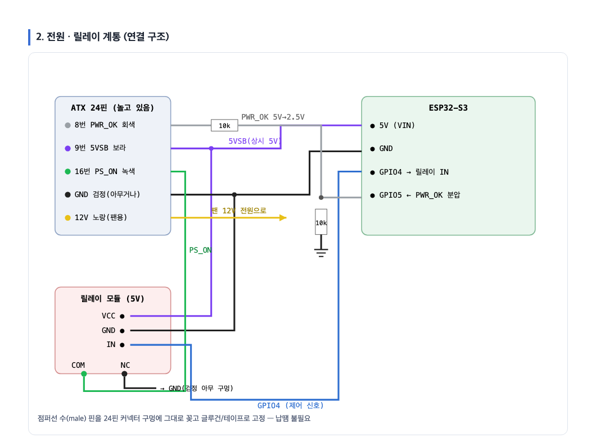
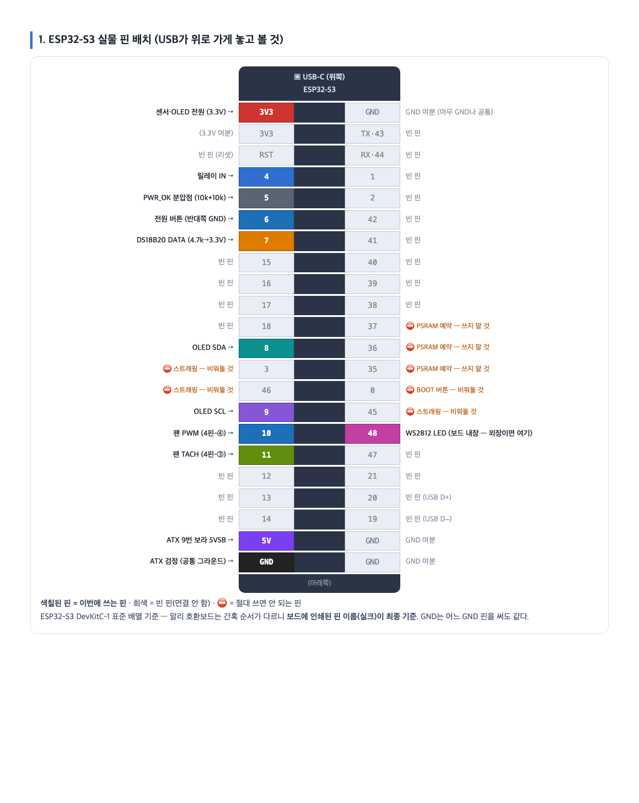
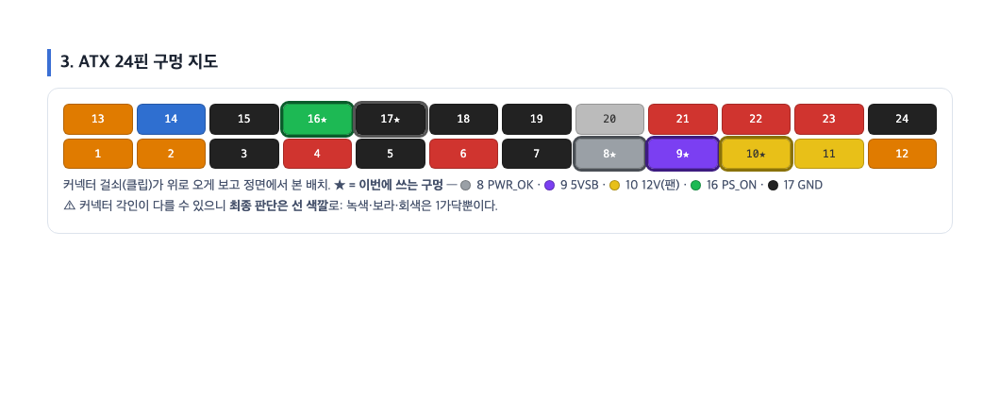

# BC250 Front Controller

**Turn your AMD BC-250 into a real PC** — smart power button, graceful shutdown, temperature-driven fan curve, OLED status display, and Home Assistant integration, all running standalone on a single ESP32-S3.

[🇰🇷 한국어 README](README.ko.md)


> ⚠️ **Status: work in progress.** Firmware boots and is verified on a bare board; full hardware validation (relay + sensors + fan on a live BC-250) is ongoing. Follow the repo for updates.

## Why?

The AMD BC-250 is a PS5-APU board that sells for roughly $100–150 these days — but it was born in a mining rack, so as a desktop it's missing everything:

- ❌ **No power button** and no ACPI — power on = PSU on
- ❌ **No graceful shutdown** — cutting power is the only "off"
- ❌ **No usable fan control** outside the original rack chassis
- ❌ **No status indication** whatsoever

This project fixes all of that with an ESP32-S3 sitting between your ATX PSU and the board — like the front panel the BC-250 never had.

## Features

- 🔌 **Real power button** — short press to power on / gracefully shut down, 5-second hold to force off
- 🛡️ **Fail-safe relay design** — the ATX `PS_ON` line is held through the relay's **NC contact**, so if the ESP32 crashes, reboots or updates, **your server stays up**
- 🧠 **Fully autonomous** — the graceful-shutdown sequence (HTTP request to the OS → wait → cut power), fan curve, OLED and button all run on the ESP32 itself. No Home Assistant, no cloud, no Wi-Fi required
- 🌡️ **Temperature-driven fan curve** — two DS18B20 probes (GPU heatsink + case), 25 kHz PWM, tach feedback with fan-failure detection
- 🖥️ **OLED status display** — power state, temperatures, fan RPM, network info on an SSD1306
- 🎛️ **On-device settings menu** — two extra buttons + the OLED give you a local menu: fan mode/preset, manual speed, display brightness, overheat threshold, shutdown timeout — all saved to flash, no phone or PC needed
- 🚨 **WS2812 status LED** — off / green (running) / yellow (shutting down) / red (fan failure, overheat)
- 🌐 **Built-in web dashboard** — control everything from a browser, straight from the ESP32
- 🏠 **Home Assistant auto-discovery** — appears natively via the ESPHome integration (optional MQTT)
- 📶 **Zero-config Wi-Fi provisioning** — first boot opens a `bc250-front-setup` AP with a captive portal; no credentials are baked into the firmware
- 🔄 **OTA updates** — flash over USB once, update over the air forever
- 📴 **Network-loss hardened** — never reboots on Wi-Fi/API loss; local control keeps working, the setup AP reopens automatically

## How it works

The BC-250 only uses the PCIe 8-pin — the ATX 24-pin connector is completely unused. So we steal three wires from it:

| ATX wire | Purpose |
|---|---|
| 🟣 Purple (pin 9, `5VSB`) | Always-on 5 V → powers the ESP32 + relay even when the PSU is "off" |
| 🟢 Green (pin 16, `PS_ON`) | Grounding this turns the PSU on — held via the relay **NC** contact |
| ⚪ Gray (pin 8, `PWR_OK`) | Tells the ESP32 whether the PSU is actually up (10k+10k divider) |



Graceful shutdown, with the **ESP32 as the source of truth** (no home-automation dependency):

```
button / web / HA  →  ESP32  →  HTTP shutdown request to the OS
                              →  wait 60 s for the OS to halt
                              →  release PS_ON (power off)
```

## Build tiers — everything is optional except the relay

Missing parts don't break anything: an absent OLED, sensor, fan or button simply disables that one feature. Start minimal, add parts whenever you feel like it.

| Tier | Hardware | You get | Firmware |
|---|---|---|---|
| **Minimal** | ESP32 + relay + 3 jumper wires | Web/HA power on-off, graceful shutdown, status LED (onboard) | [`bc250-front-minimal.yaml`](bc250-front-minimal.yaml) |
| **+ Button** | + push button | Physical front-panel power button | same |
| **Full** | + OLED, 2× DS18B20, PWM fan, 2 menu buttons, PWR_OK divider | Fan curve, temperatures, display, on-device settings menu, PSU state | [`bc250-front.yaml`](bc250-front.yaml) |
| **Full + color LCD** | Full, but OLED → **ST7789V 2.4" 240×320 SPI** | All of the above + large color UI, status icons, backlight dimming | [`bc250-front-st7789.yaml`](bc250-front-st7789.yaml) |

## Hardware

| Part | Qty | ~Cost |
|---|---|---|
| ESP32-S3 dev board (2×22 pins) | 1 | $5 |
| 5 V 1-channel relay module (optocoupler) | 1 | $1 |
| SSD1306 0.96" OLED (I2C) | 1 | $2 |
| DS18B20 temperature sensor | 2 | $2 |
| Momentary push button (power + 2 menu) | 3 | $1 |
| Resistors: 2× 10 kΩ, 1× 4.7 kΩ | — | $0.1 |
| Dupont jumper wires | — | $1 |

**No soldering required** — male jumper pins fit straight into the unused ATX 24-pin connector holes.

## Wiring





| ESP32-S3 pin | Connects to |
|---|---|
| `5V` | ATX pin 9 — purple `5VSB` |
| `GND` | ATX black (common ground) |
| `3V3` | OLED VCC, DS18B20 VDD, pull-ups |
| `GPIO4` | Relay IN |
| `GPIO5` | ATX pin 8 — gray `PWR_OK` (**via 10k+10k divider**) |
| `GPIO6` | Power button (other leg → GND) |
| `GPIO7` | DS18B20 data ×2, 4.7 kΩ pull-up to 3.3 V |
| `GPIO8` / `GPIO9` | OLED SDA / SCL |
| `GPIO10` | Fan PWM (4-pin fan, pin 4) |
| `GPIO11` | Fan tach (4-pin fan, pin 3) |
| `GPIO12` / `GPIO13` | Menu buttons A (navigate) / B (select) — other leg → GND |
| `GPIO48` | WS2812 (onboard on most devkits) |

Relay contacts: **COM ↔ ATX pin 16 (green `PS_ON`)**, **NC ↔ GND**, NO unused.

Full interactive wiring guide (Korean): [`docs/wiring-guide.html`](docs/wiring-guide.html) (OLED) · [`docs/wiring-guide-st7789.html`](docs/wiring-guide-st7789.html) (ST7789V)

## Flashing

```bash
pip install esphome
esphome run bc250-front.yaml   # first time over USB, afterwards OTA
```

First boot: join the **`bc250-front-setup`** Wi-Fi AP from your phone → the captive portal opens → pick your network, enter the password. Done. Home Assistant will auto-discover the device within minutes.

> **Board note:** on CH343-based devkits the logger must use `hardware_uart: UART0` (already set in the YAML) — the default USB-JTAG console is not routed to the USB port on those boards.

## Roadmap

- [ ] OS-side shutdown agent (tiny systemd unit) + install script
- [ ] INA226 power monitoring (watts on the OLED!)
- [ ] Web-editable fan curve
- [ ] 3D-printable front-panel enclosure
- [ ] Buzzer alerts / event log

PRs and issues welcome — especially test reports from different BC-250 setups.

## Credits

- [mothenjoyer69/bc250-documentation](https://github.com/mothenjoyer69/bc250-documentation) — the definitive BC-250 hardware reference
- [elektricM/amd-bc250-docs](https://github.com/elektricM/amd-bc250-docs) — power & cooling documentation
- Built with [ESPHome](https://esphome.io)

## License

[MIT](LICENSE)
