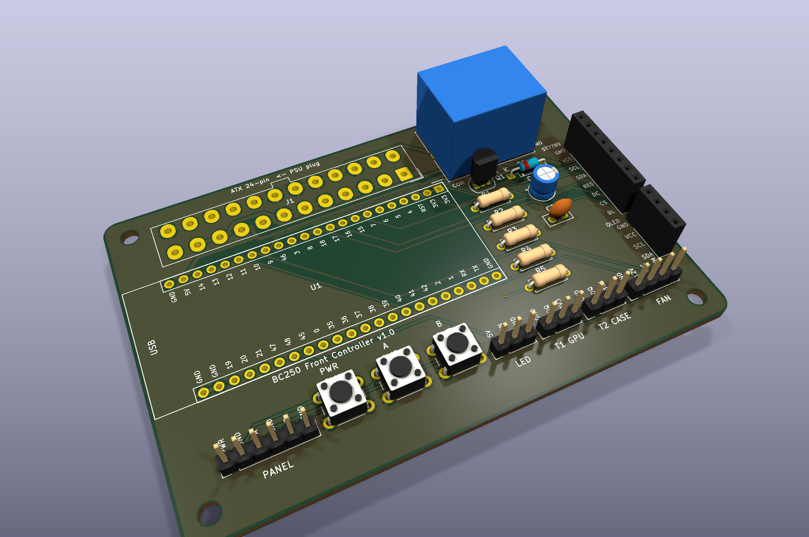

# BC250 Front Controller — carrier PCB v1.0

A carrier board for the ESP32-S3-DevKitC-1. **The PSU's ATX 24-pin plug goes straight onto the board**, so 5VSB / PS_ON / PWR_OK / 12V / GND are wired without jumper wires or hot glue. Every part is through-hole — a soldering iron is all you need.

[🇰🇷 한국어](README.ko.md)

| | |
|---|---|
| Size | 96 × 64 mm, 2 layers, 1.6 mm, 4× M3 holes (87 × 55 mm spacing) |
| MCU | ESP32-S3-DevKitC-1 (2×22 pins) in two female sockets |
| Power | ATX 24-pin header (Molex Mini-Fit Jr 5566-24A) on board |
| Relay | SRD-05VDC-SL-C + S8050 NPN driver on board — same **NC fail-safe** wiring as before |
| Display | ST7789 2.4″ SPI 8-pin socket **and** SSD1306 OLED 4-pin socket (fit either) |
| Other connectors | 4-pin PWM fan, 2× DS18B20, external WS2812, 6-pin front-panel buttons + 3 on-board tact switches |
| Checks | KiCad 10 ERC / DRC / schematic-PCB parity: **0 violations** (not yet verified on a physical board — see first power-up below) |

## Files

| File | Purpose |
|---|---|
| [`gerbers/bc250-front-carrier-v1.0-gerbers.zip`](gerbers/bc250-front-carrier-v1.0-gerbers.zip) | **upload this to JLCPCB** (Gerbers + Excellon drill + job file) |
| `bc250-front-carrier.kicad_pro` / `.kicad_sch` / `.kicad_pcb` | KiCad 10 project, footprint and symbol libraries included (opens anywhere) |
| [`bc250-front-carrier-schematic.pdf`](bc250-front-carrier-schematic.pdf) | schematic |
| [`bom.csv`](bom.csv) | bill of materials |
| `bc250-front-carrier-pos.csv` | component positions (assembly reference) |
| `images/` | top / bottom / iso renders, layout SVG, schematic SVG |
| [`../tools/`](../tools/) | regenerates the whole board from scripts (`build.sh`) |

## Ordering at JLCPCB

1. [jlcpcb.com](https://jlcpcb.com) → **Order now** → *Add gerber file* → upload `gerbers/bc250-front-carrier-v1.0-gerbers.zip`
2. It is detected as 96 × 64 mm, 2 layers. Keep the **defaults**: FR-4, 1.6 mm, 1 oz, HASL, quantity 5 (colour is up to you, Remove Order Number: No).
3. No SMT assembly needed — everything is hand-soldered.
4. Expect roughly $2 for 5 boards plus shipping.

## BOM

| Ref | Qty | Part | Notes |
|---|---|---|---|
| U1 | 1 | ESP32-S3-DevKitC-1 (N8R2 / N16R8, either) | with male pin headers soldered |
| U1 sockets | 2 | 1×22 female pin socket 2.54 mm | solder with the DevKit plugged in for alignment |
| J1 | 1 | ATX 24-pin motherboard header (Molex 5566-24A / 39-28-1243 or compatible, 4.2 mm 2×12 vertical) | |
| K1 | 1 | SRD-05VDC-SL-C relay (Songle / Sanyou SRD) | |
| Q1 | 1 | S8050 NPN (2N2222A / BC337 also fine) | TO-92, E-B-C |
| D1 | 1 | 1N4148 | cathode band toward the **K** mark |
| R1 | 1 | 1 kΩ | |
| R2, R3, R4 | 3 | 10 kΩ | |
| R5 | 1 | 4.7 kΩ | |
| C1 | 1 | 100 µF 16 V electrolytic (5 mm) | long leg (+) to the **+** mark |
| C2 | 1 | 100 nF ceramic | |
| J2 | 1 | 1×8 female pin socket | ST7789 LCD module plugs in directly |
| J3 | 1 | 1×4 female pin socket | SSD1306 OLED module plugs in directly |
| J4 | 1 | 1×4 male pin header | 4-pin fan (a real fan header fits too) |
| J5, J6, J7 | 3 | 1×3 male pin header | 2× DS18B20, WS2812 |
| J8 | 1 | 1×6 male pin header | front-panel buttons (optional) |
| SW1–SW3 | 3 | 6×6 mm tactile switch | on-board PWR / A / B |
| H1–H4 | 4 | M3 standoffs | optional |

## Assembly order

1. **Low parts first**: R1–R5 → D1 (band to `K`) → Q1 (flat side as drawn on the silkscreen) → C2 → C1 (mind the `+`)
2. **Sockets and headers**: J2/J3 female sockets, J4–J8 pin headers, SW1–SW3, the two 1×22 sockets for U1
3. **Big parts**: K1 relay, J1 ATX header — the latch ramp faces the top board edge (the `ATX 24-pin ← PSU plug` text)

## ⚠️ First power-up — **before** fitting the ESP32

The ATX header pin numbering follows KiCad's standard Molex 5566-24A footprint, but no physical board has been verified yet. This takes a minute:

1. Plug in the PSU's 24-pin **without** the DevKit and switch the PSU on. The relay is idle (NC), so **the PSU turning on immediately is correct** — that is the fail-safe.
2. With a multimeter (also printed on the back silkscreen):
   - U1 socket, top row `5V` pin ↔ `GND` = **about 5 V**
   - `FAN` header `12V` pin ↔ `GND` = **12 V**
   - If the `5V` pin reads 0 V or 12 V, **stop** and check J1 orientation/solder joints.
3. Power the PSU off and fit the DevKit: USB connectors toward the **left board edge** (`USB` silkscreen), antenna toward the relay.

## Firmware

- Set **`relay_inverted: "false"`** under `substitutions:` in the yaml (this board drives the relay with an NPN, active-high; off-the-shelf relay modules are `"true"`).
- If you attach an external WS2812 to J7, adjust `num_leds` in `light:` (the DevKit's on-board LED is pixel 0).
- Everything else matches the [wiring guide](../../docs/wiring-guide.html) — the board simply implements that wiring.

## Design notes

- **Relay**: COM=PS_ON, NC=GND. PS_ON is grounded at rest, so the PSU is on. GPIO4 HIGH → Q1 → coil energised → NC opens → PSU off. R2 (10 k) keeps the coil off while the ESP32 boots; D1 clamps the flyback. NO is left open.
- **PWR_OK**: 5 V → R3/R4 10 k/10 k → 2.5 V → GPIO5.
- **1-Wire**: GPIO7 with R5 4.7 k to 3V3; both DS18B20s in parallel on J5/J6.
- **Power**: 5VSB → DevKit `5V` pin (on-board LDO) + relay coil (C1 100 µF). 3V3 from the DevKit LDO feeds J2/J3/J5/J6/R5. 12 V is fan-only (present only while the PSU is on).
- **Layout**: 0.3 mm signals, 0.7 mm power, GND pours on both sides, copper keep-out under the WROOM antenna. Autorouted with Freerouting, DRC clean.

## Regenerating

Rather than editing the `.kicad_pcb` by hand, change `../tools/gen_pcb.py` (placement, nets) or `gen_sch.py` (schematic) and run `../tools/build.sh`. It needs KiCad 10 and Java 21+; Freerouting is downloaded automatically. The outputs are installed back into this folder.
