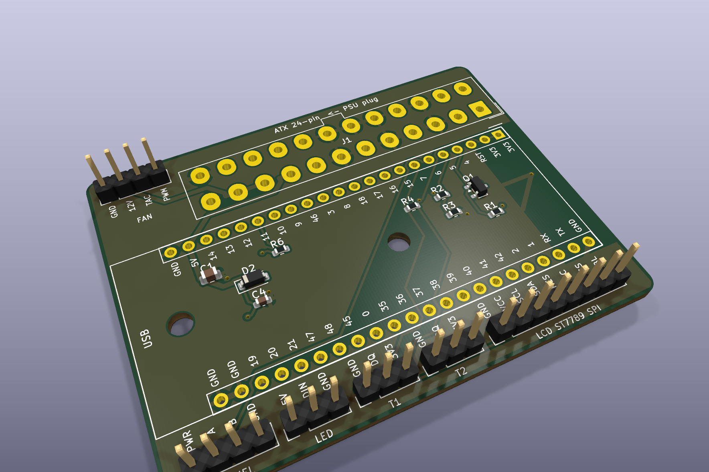

# BC250 Front Controller — DevKit 미니 보드 v1.0 (66 × 50 mm)

ESP32-S3-DevKitC-1(2×22핀)을 소켓에 꽂고, **PSU의 ATX 24핀 플러그를 보드에 그대로 꽂는** 가장 작은 버전입니다. 케이블 가공 없음. 저항·MOSFET 같은 작은 부품은 전부 DevKit **밑**(소켓 두 줄 사이)에 들어가 있어서 보드가 DevKit보다 조금 큰 정도예요. 디스플레이는 1×8 핀헤더에 점퍼선으로 연결합니다.

[🇺🇸 English](README.md) · 다른 보드: [DIY 캐리어 (96×64)](../bc250-front-carrier/README.ko.md) · [반조립 PCBA (90×56)](../bc250-front-pcba/README.ko.md)



| | |
|---|---|
| 크기 | **66 × 50 mm**, 2층, 1.6 mm, M3 홀 2개 (DevKit 밑) |
| MCU | ESP32-S3-DevKitC-1 (N8R2 / N16R8 아무거나) — 1×22 암소켓 2개에 꽂음. USB 끝이 보드 왼쪽 가장자리, 안테나는 오른쪽 |
| 전원 | ATX 24핀 헤더 온보드. 5VSB → DevKit `5V` 핀 (DevKit 자체 LDO가 3.3 V). 12 V는 팬 전용 |
| 전원 제어 | **MOSFET(AO3400A)** 이 PS_ON을 접지 — 무소음, fail-safe (ESP32가 죽어도 PSU ON) |
| 디스플레이 | 1×8 핀헤더 `GND VCC SCL SDA RES DC CS BL` → ST7789 모듈에 선으로 (15 cm 이내) |
| 센서 | T1·T2 3핀 헤더 — DS18B20 ×2 (GPIO7 1-Wire 공용, 4.7 k 풀업 내장) |
| 기타 | 4핀 PWM 팬(윗변), 외장 WS2812 헤더, 전면 버튼 4핀 헤더 (PWR A B GND) |
| 검증 | KiCad 10 ERC / DRC / 회로도-PCB 정합성 **0건**. **실물 검증은 아직 없음** — 아래 첫 전원 절차대로 |

v1.0 보드들에서 고친 점: PWR_OK 분압 10k/**20k** (2.5 V → 3.3 V, GPIO HIGH 규격 여유 확보) · 외장 LED 헤더 5V를 D2 뒤 ~4.3 V에서 공급 (3.3 V 데이터선을 WS2812B가 확실히 인식) · 팬 TACH에 10 k 직렬 (12 V 풀업 팬 보호).

## 파일

| 파일 | 용도 |
|---|---|
| [`gerbers/bc250-front-mini-v1.0-gerbers.zip`](gerbers/bc250-front-mini-v1.0-gerbers.zip) | JLCPCB 업로드용 거버 + 드릴 |
| [`jlcpcb-bom.csv`](jlcpcb-bom.csv) · [`jlcpcb-cpl.csv`](jlcpcb-cpl.csv) | (선택) JLCPCB Economic 조립 — **SMD 8개만** (전부 Basic 부품, 로딩비 0) |
| `jlcpcb-bom-full.csv` · `jlcpcb-cpl-full.csv` | ATX 헤더·1×3/1×4 핀헤더까지 조립시킬 때 (Extended 3종, +$9) |
| `bc250-front-mini.kicad_pro` / `.kicad_sch` / `.kicad_pcb` | KiCad 10 프로젝트 (라이브러리 동봉) — 열어서 직접 고쳐도 됨 |
| [`bc250-front-mini-schematic.pdf`](bc250-front-mini-schematic.pdf) | 회로도 |
| `images/` | 렌더링·레이아웃·회로도 SVG |
| [`../tools/`](../tools/) | `build.sh mini` 로 전체 재생성 (`designs/mini.py` 편집) |

## 부품 목록

| Ref | 수량 | 부품 | 비고 |
|---|---|---|---|
| U1 | 1 | **ESP32-S3-DevKitC-1** (핀헤더 납땜된 것) | 알리 ₩6,000~ |
| U1 소켓 | 2 | 1×22 암 핀소켓 2.54 mm | 1×40 소켓 잘라서 써도 됨 |
| J1 | 1 | ATX 24핀 보드용 헤더 **Molex 5566-24A** (4.2 mm 2×12 수직) | 검색어: `5566-24A` / "ATX 24핀 커넥터 보드용" — LCSC C114088 |
| Q1 | 1 | AO3400A N-MOSFET SOT-23 | C20917 |
| R1 R2 R6 | 3 | 10 kΩ 0603 | C25804 |
| R3 | 1 | **20 kΩ** 0603 | C4184 |
| R4 | 1 | 4.7 kΩ 0603 | C23162 |
| D2 | 1 | 1N4148W SOD-123 | C81598 |
| C1 | 1 | 10 µF 0805 | C15850 |
| C4 | 1 | 100 nF 0603 | C14663 |
| J2 | 1 | 1×8 수 핀헤더 | LCD |
| J4 J8 | 2 | 1×4 수 핀헤더 | FAN · PANEL — C124378 |
| J5 J6 J7 | 3 | 1×3 수 핀헤더 | T1 · T2 · LED — C49257 |

SMD 8개는 0603/0805/SOT-23라 인두로도 되지만, JLCPCB에 **Economic 조립**(`jlcpcb-bom.csv` + `jlcpcb-cpl.csv`)을 시키면 5장에 약 **$12** (PCB $2 + 셋업 $8 + 부품 $1.5)로 끝납니다. 나머지(소켓·헤더·ATX)는 관통형이라 직접 납땜.

## 조립 순서

1. **SMD** (JLC 조립이면 건너뜀): DevKit 밑 자리의 Q1·D2·R1~R6·C1·C4. 실크 `1` 표시 = D2 캐소드(K).
2. **핀헤더** (J2·J4~J8) → 짧은 것부터.
3. **DevKit 소켓**: 소켓 2개를 DevKit에 먼저 꽂고 통째로 보드에 끼운 뒤 납땜하면 정렬이 맞습니다. DevKit의 **USB가 보드 왼쪽 가장자리(실크 `USB`)**, 안테나가 오른쪽.
4. **ATX 헤더** 마지막 (열용량이 커서 인두 온도 높게). 걸쇠 홈 면이 보드 위쪽 가장자리(`ATX 24-pin <- PSU plug` 글자 쪽).

## ⚠️ 첫 전원 인가 — DevKit을 꽂기 **전에**

1. 소켓만 있는 보드에 PSU 24핀만 꽂고 PSU AC on. **PSU가 바로 켜지는 게 정상** (fail-safe).
2. 멀티미터: 소켓 윗줄 `5V` ↔ `GND` = **약 5 V** · `FAN` 헤더 `12V` = 12 V · `T1` `3V3`는 아직 0 V (DevKit이 없으니 정상).
3. `5V` 자리에 0 V나 12 V가 나오면 J1 방향·납땜 확인하고 **진행 중지**. 이상 없으면 PSU 끄고 DevKit 장착.
4. USB로 `esphome run bc250-front-st7789.yaml` → 대시보드에서 "서버 전원" 끄기 → PSU 꺼지면 OK.

## 펌웨어 — 기존 yaml에 한 줄

```yaml
substitutions:
  relay_inverted: "true"   # 릴레이 모듈과 같은 극성 (GPIO4 LOW = 전원 차단)
  # log_uart 는 기본값 UART0 그대로 (DevKit의 USB-시리얼)
```
GPIO는 점퍼선 배선과 100 % 동일 — `bc250-front.yaml` / `bc250-front-st7789.yaml` / `bc250-front-minimal.yaml` 전부 그대로.

## 커넥터

| 라벨 | 핀 (실크 순서) | 비고 |
|---|---|---|
| `LCD` (J2) | GND VCC SCL SDA RES DC CS BL | ST7789 모듈 라벨과 1:1 — 같은 이름끼리 선으로 |
| `FAN` (J4, 윗변) | GND 12V TAC PWM | 4핀 PWM 팬 |
| `T1` `T2` (J5 J6) | GND DQ 3V3 | DS18B20 (둘 다 GPIO7) |
| `LED` (J7) | 5V DIN GND | 외장 WS2812 (5V 자리는 실제 ~4.3 V — 의도된 것) |
| `PANEL` (J8) | PWR A B GND | 전면 버튼 3개, 반대쪽 다리는 전부 GND |

LCD 선은 **15 cm 이내**로. 화면이 깨지면 yaml `spi:` 의 `data_rate`를 20 MHz로 낮추세요.

## 설계 메모
- **PS_ON**: Q1 드레인 → PS_ON, 소스 → GND, 게이트 ← GPIO4 + R1 10 k 풀업(3V3). ESP32 리셋/다운로드/사망 시 풀업이 게이트를 HIGH → PSU ON. 펌웨어가 GPIO4 LOW → PSU OFF.
- **PWR_OK**: 5 V → R2 10 k / R3 20 k → 3.3 V → GPIO5. (구 보드의 10k/10k = 2.5 V는 ESP32-S3 VIH 최소 2.475 V에 너무 가까움.)
- **LED**: 5 V → D2 → ~4.3 V → J7. WS2812B는 데이터 HIGH ≥ 0.7×VDD 필요 → 4.3 V면 3.3 V 데이터 OK. 1N4148W 150 mA라 LED 2개까지.
- **FAN TACH**: R6 10 k 직렬 → 일부 팬의 12 V 내부 풀업에서 GPIO11 보호. PWM은 3.3 V 직결.
- **안테나**: DevKit 오른쪽 끝(안테나) 아래는 양면 구리 제거 구역.
- **홀**: M3 ×2, DevKit 밑에 있음 — 소켓 높이(8.5 mm) 덕분에 너트/스탠드오프가 들어감.
- **ATX 헤더 방향**: KiCad 표준 Molex 5566-24A 풋프린트 기준(캐리어/PCBA와 동일). 실물 검증 전이므로 위 첫 전원 절차 필수.
