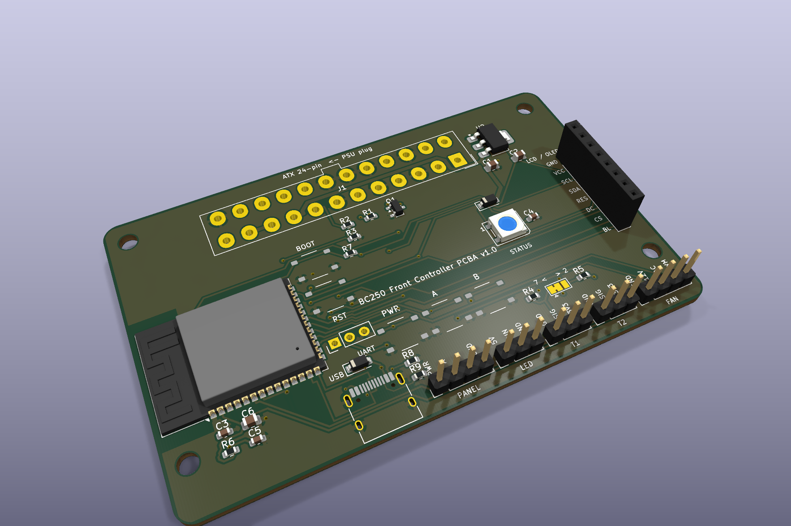

# BC250 Front Controller — semi-assembled PCBA v1.0 (JLCPCB Economic assembly)

JLCPCB places every resistor, capacitor, the MOSFET, LDO, USB-C, ATX header, pin headers and buttons; **you hand-solder three parts: the ESP32-S3 module, the display socket and (optionally) the status LED.** Leaving those out lets JLCPCB use the cheap **Economic** assembly (the ESP32 module and 5050 LEDs are "Standard only" parts), which cuts the fixed fees by about $22.

[🇰🇷 한국어](README.ko.md) · fully hand-soldered DevKit version: [`../bc250-front-carrier/`](../bc250-front-carrier/README.md)



| | |
|---|---|
| Size | 90 × 56 mm, 2 layers, 1.6 mm, 4× M3 |
| MCU | **ESP32-S3-WROOM-1** module (hand-soldered; any of N4/N8/N8R2/N16R8) + USB-C native USB (no USB-serial chip) |
| Power switch | **MOSFET (AO3400A)** grounds PS_ON — no relay, silent, same fail-safe (PSU stays on when the ESP32 is dead) |
| Power | 5VSB from the ATX header → AMS1117-3.3. 12 V is fan-only |
| Display | 1×8 socket position (hand-soldered) for the **ST7789 (8 pins) or SSD1306 OLED (first 4 pins)** |
| Sensors | T1/T2 3-pin headers — DS18B20 **or 10 kΩ NTC** (4.7 k pull-ups on board) |
| Other | 4-pin PWM fan, WS2812B status LED position (optional) + external LED header, 4-pin front-panel header, PWR/A/B/BOOT/RESET buttons |
| Checks | KiCad 10 ERC / DRC / schematic-PCB parity: 0 violations. **Not verified on hardware yet** — follow the first power-up steps |

## Files

| File | Purpose |
|---|---|
| [`gerbers/bc250-front-pcba-v1.0-gerbers.zip`](gerbers/bc250-front-pcba-v1.0-gerbers.zip) | JLCPCB step 1: Gerbers |
| [`jlcpcb-bom.csv`](jlcpcb-bom.csv) · [`jlcpcb-cpl.csv`](jlcpcb-cpl.csv) | JLCPCB step 2: **default (semi-assembled)** BOM/CPL — U1, J2, LED1 excluded |
| `jlcpcb-bom-full.csv` · `jlcpcb-cpl-full.csv` | if you want everything placed (needs Standard assembly, ≈ +$30) |
| `bc250-front-pcba.kicad_pro` / `.kicad_sch` / `.kicad_pcb` | KiCad 10 project (libraries included) |
| [`bc250-front-pcba-schematic.pdf`](bc250-front-pcba-schematic.pdf) | schematic |
| `images/` | renders, layout and schematic SVG |
| [`../tools/`](../tools/) | `build.sh pcba` regenerates everything |

## Ordering at JLCPCB

1. [jlcpcb.com](https://jlcpcb.com) → **Order now** → upload `gerbers/bc250-front-pcba-v1.0-gerbers.zip`. PCB options: defaults (FR-4, 1.6 mm, HASL). Quantity **at least 2**, 5 recommended.
2. **PCB Assembly** on → **Economic** · Top side · assembly quantity = board quantity.
3. **Add BOM / CPL**: upload `jlcpcb-bom.csv` + `jlcpcb-cpl.csv` → all 22 lines should auto-match LCSC parts. (Extended parts: ATX header, USB-C, two pin-header types = 4; everything else is Basic.)
4. **Placement preview**: `J3` USB-C opening toward the **bottom edge**; `Q1` (SOT-23), `U2` (SOT-223), `D1`/`D2` matching the silkscreen. Rotate in the preview if not.
5. Pay → 1–2 weeks.

### Cost (estimate for 5 boards, Aug 2026 — the JLCPCB quote is authoritative)

| Item | Amount |
|---|---|
| PCB ×5 | ~$2 |
| Economic assembly setup + stencil | ~$8 + ~$1.5 |
| Extended-part loading fee ×4 | ~$12 |
| placed parts (≈ $2.6 / board) | ~$13 |
| assembly SMT + THT (≈ $1.7 / board) | ~$8.5 |
| **JLCPCB total (5)** | **≈ $45 + shipping → ≈ $9 each** |
| **JLCPCB total (2)** | **≈ $32 + shipping** |
| + bought separately: ESP32-S3-WROOM-1 (~$3.5), 1×8 female socket, WS2812B 5050 (optional) | ≈ $4 each |

→ **≈ $13 per board + display, sensors, fan.** Fully assembled (Standard, `*-full.csv`) is ≈ $100 for 5.

### Cost reductions in this version

| Item | Before | After |
|---|---|---|
| Assembly tier | Standard ($25 + $7) | **Economic ($8 + $1.5)** — only the module and LED are hand-soldered |
| Relay + driver (SRD-05V, S8050, 1N4148, 100 µF) | ~$0.7 + 4 THT parts | **one AO3400A MOSFET** ($0.09), silent |
| DevKit ($4.5–5) | 2 sockets + separate purchase | **WROOM module** ($3.5) + USB-C ($0.31) + LDO ($0.12) |
| THT R/C | 7 THT parts | **0603/0805 Basic parts** (no loading fee) |
| OLED socket + LCD socket | 2 parts | **one 1×8 socket** (OLED on the first 4 pins) |
| Front-panel header 1×6 | 1 extended part | **1×4** → same part as the fan header |
| Tact switches | 6×6 THT | **TS-1187A SMD (Basic, $0.02)** ×5 |
| Temperature sensors | 2× DS18B20 (~$2 each) | **10 kΩ NTC also supported** (~$0.2 each) |
| ESP32-S3 | N16R8 | **N4/N8 fine too** (no PSRAM needed) — you buy it, pick the cheapest |

ESP32-C3 was not adopted: the full build needs 15 GPIOs, the C3 exposes 13, and the saving is under $1. Possible for OLED/minimal-only builds.

## The three parts you solder

| Part | How |
|---|---|
| **U1 ESP32-S3-WROOM-1** | Iron-solder the edge castellations (1.27 mm pitch): flux → tack two corners to align → the rest. The large centre GND pad is **optional** (GND is also on edge pins 1/40; use hot air if you have it). Antenna toward the left board edge (see the silkscreen antenna outline). |
| **J2 display** | Solder a 1×8 2.54 mm female socket and plug the module in (recommended), or solder the module's pin header straight to the board. The OLED goes on the GND·VCC·SCL·SDA positions. |
| **LED1 WS2812B** (optional) | 5050, 4 pads, pin-1 mark (silk `1`) top-left. If you skip it, the external `LED` header (J7) carries the same data line, so nothing is lost. |

## Using it

### Firmware (same yaml, two substitutions)
```yaml
substitutions:
  relay_inverted: "true"        # same polarity as the relay module (GPIO4 LOW = power cut)
  log_uart: USB_SERIAL_JTAG     # logs over native USB
```
GPIO numbers are identical to the DevKit wiring — `bc250-front.yaml`, `bc250-front-st7789.yaml`, `bc250-front-minimal.yaml` flash unchanged. First flash over USB-C (`esphome run`), OTA afterwards. If auto-download does not trigger, hold **BOOT** and tap **RESET**. With only an external LED keep `num_leds: 1` (it shows the same pixel 0 as LED1).

### Temperature sensors — DS18B20 or NTC
- **Two DS18B20 (default)**: T1 and T2 on the GPIO7 1-Wire bus. Yaml unchanged.
- **Two NTCs (cheapest)**: move solder jumper **JP1** on the back from `1-2` (default, silk "7") to `2-3` (silk "2") so T2 gets its own channel on GPIO2. Wire each NTC between SIG and GND and replace `one_wire`/`dallas_temp` with:
  ```yaml
  sensor:
    - platform: adc
      pin: GPIO7            # T1 (T2: GPIO2)
      id: t1_adc
      attenuation: 12db
      update_interval: 5s
    - platform: resistance
      sensor: t1_adc
      configuration: DOWNSTREAM   # NTC to GND, 4.7k pull-up to 3V3
      resistor: 4.7kOhm
      reference_voltage: 3.3V
      id: t1_res
    - platform: ntc
      sensor: t1_res
      id: gpu_temp
      name: "GPU temperature"
      calibration:
        b_constant: 3950
        reference_temperature: 25°C
        reference_resistance: 10kOhm
  ```

### Connectors
| Label | Pins | Note |
|---|---|---|
| `LCD / OLED` (J2) | GND VCC SCL SDA RES DC CS BL | all 8 for ST7789 / first 4 for the OLED |
| `FAN` (J4) | GND 12V TACH PWM | 4-pin PWM fan |
| `T1` `T2` (J5 J6) | GND SIG 3V3 | DS18B20 (GND DQ VDD) or NTC (GND–SIG) |
| `LED` (J7) | 5V DIN GND | external WS2812, in parallel with LED1 (pixel 0) |
| `PANEL` (J8) | PWR A B GND | front buttons, in parallel with the on-board ones |
| `UART` (J9, not populated) | TX RX GND | debug |

### ⚠️ First power-up
1. **Before** soldering the module: plug in the PSU 24-pin only and switch the PSU on → **the PSU turning on immediately is correct** (fail-safe).
2. Check `T1` `3V3`–`GND` = 3.3 V, `FAN` `12V` = 12 V, `LED` `5V` = 5 V (also printed on the back). If fine, power off and solder the module.
3. Connect USB-C → `esphome run` → switch "server power" off in the web dashboard → the PSU should turn off.

## Design notes
- **PS_ON**: Q1 drain → PS_ON, source → GND, gate ← GPIO4 with R1 10 k pull-up to 3V3. While the ESP32 is in reset/download/dead the pull-up holds the gate high → PSU on. Firmware drives GPIO4 low → PSU off. Same logic as the active-low relay module, hence `relay_inverted: "true"`.
- **USB**: VBUS → D1 (B5819W) → 5 V rail: runs from USB alone, and the PSU's 5VSB never back-feeds the USB host. D+/D− pad pairs of the receptacle are bridged with locked tracks.
- **LED**: WS2812B VDD dropped to ~4.3 V through D2 (1N4148W) so 3.3 V data is a valid high. J7 shares the same data line (parallel).
- **BOOT/RESET**: R7/R6 10 k pull-ups, C5 1 µF EN delay.
- **Antenna**: module antenna toward the left board edge, copper removed on both layers underneath.
- **CPL rotations**: corrected by comparing pin-1 positions of the KiCad footprints against the JLCPCB (EasyEDA) footprints of the exact LCSC parts (SOT-23 / SOT-223 +180°, everything else 0°).
